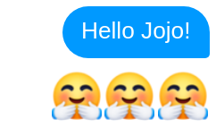

<h1 align="center">
  
  <br/>
</h1>

> Conversational UI Framework for The Future

Machinat is a declarative, progressive and cross-platform JavaScript framework for building conversational UI/UX.

*Chat Bot* is the most easy-to-use app format to get in touch with users. But making a bot is never easy, here are some problems you might meet:

  - Handle more complex and more unpredictable user input.
  - Interact using Conversational UI and Graphical UI at the same time.
  - Manage conversation flow in a stateless backend.
  - Support multiple platforms to reach most of users.
  - Embed a webview for more features and even better experiences.

These challenges are new and very different from the GUI based *Mobile Apps* or *Web Apps*. To build the next-gen app, we need a next-gen solution.

## Highlights

  - Make one app, serve on all chat platforms.
  - Declarative API for **in-Chat UI** & **Conversation Flow.**
  - Keeps all native features form the original chat platforms.

  - Standard interfaces for external services, include accessing state data and intent recognizing.

  - Render dynamic and modular UI with customizable component.


  - Embedded webview within the chat.
  - Progressive design. Extendable and Replacable


## Documents

- Main Concept:
  - [Getting Started](docs/getting-started.md)
  - [Receiving Events](docs/receiving-events.md)
  - [Introducing JSX](docs/introducing-jsx.md)
  - [Rendering Elements](docs/rendering-elements.md)
  - [Components for CUI](docs/components-for-cui.md)

- Advanced topic
  - [Dependency Injection](docs/dependency-injection.md)
  - [Recognizing Intent](docs/recognizing-intent.md)
  - [Using States](docs/using-states.md)
  - [Staged Dialog](docs/staged-dialog.md)
  - [Integration with Webview](docs/integration-with-webview.md)
  - [Reactive Programming](docs/reactive-programming.md)

## Platforms

Platforms are sources where events come from and possibly you can make reactions to. Machinat works like as a hub to communicate to all the channels, including instant messaging, voice assistant, SMS, e-mail, terminal console or any other event-based sources.

The following platforms are officially supported for now:

- Messenger - [`@machinat/messenger`](packages/messenger), receive/send messages as a Facebook page in [Messenger](https://www.messenger.com).
- LINE - [`@machinat/line`](packages/line), receive/send messages as a [LINE](https://line.me) official account.
- Next.js - [`@machinat/next`](packages/next), serve your web app with [Next.js](https://nextjs.org/).
- WebSocket - [`@machinat/websocket`](packages/websocket), connect to the web front-end with [WebSocket](https://developer.mozilla.org/en-US/docs/Web/API/WebSockets_API).

## Examples

Machinat is flexible to use only the features and platforms you need, check [`./examples`](examples) for a most suitable one to start with.

A simplest Machinat app looks like:

```js
import Machinat from '@machinat/core';
import Http from '@machinat/http';
import Messenger from '@machinat/messenger';

function Hello({ name }) {
  return (
    <p>
      Hello {name}!
      <br />
      🤗🤗🤗
    </p>
  );
}

Machinat.createApp({
  modules: [
    Http.initModule({ port: 8080 }),
  ],
  platforms: [
    Messenger.initModule({ ... }),
  ],
})
  .onEvent(async ({ bot, event }) => {
    await bot.render(event.channel, <Hello name="Jojo" />);
  })
  .start();
```

The code above start a server on port 8080 listening to the webhooks from _Messenger_. Each time receive an event, it replies to user like this:



The HTML like syntax is called JSX, you might have seen it in some fornt-end framework like [React.js](https://reactjs.org/docs/introducing-jsx.html) or [Vue.js](https://vuejs.org/v2/guide/render-function.html#JSX). But instead of being rendered into HTML in a web page, it's rendered into a chatroom or somewhere else the conversation is happening.

## Philosophy

- **Omni-channel App**: Omni-channel marketing and customer service is the trend nowadays. Therefor it is important for business to have omni-channel applications to touch and serve more customer automatically.

  Machinat is a framework designed to serve multiple communication platforms with consistent user experiences  at the same time. We focus on the Instant Messaging platforms at first, i.e. for the _chatbots_, and will then expand to other platforms like SMS, e-mail, voice assistants and social medias later.

  The goal of Machinat is to enable developers to build one-for-all conversational apps to communicate with users from every platform.

- **Declarative**: Like React.js, Machinat JSX API provide a [DSL](https://en.wikipedia.org/wiki/Domain-specific_language) that is declarative and flexible to define the presentation logic. The conversational UIs compose a "view" of expression as the way represent in the chatroom.

  Declarative views make the conversational UI/UX code more expressive, predictable and also more easier to debug.

- **Component-Based**: One of the major challenge of building UIs is the nested presentation logic, so does for CUI. For example, how a chatbot greet in many different situations under different conversation contexts?

  With Machinat all the greeting logic can be encapsulated into a reusable `Hello` component. Components help to build conversational UI/UX in many aspects, including identical character, composing complex expressions and more skillful talk.

## Compare

WIP
